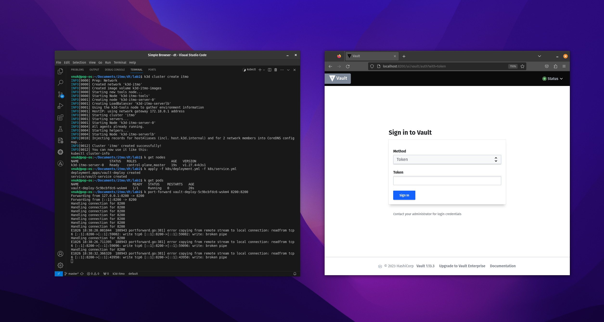
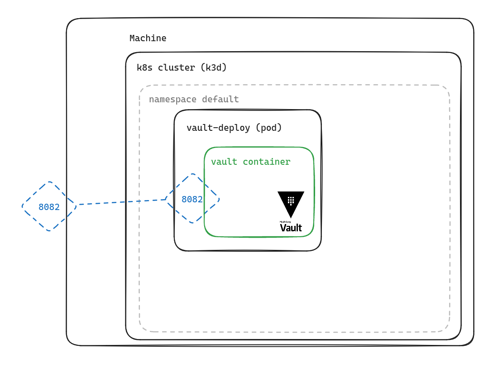

# Lab #1

University: [ITMO University](https://itmo.ru/ru/)
Faculty: [FICT](https://fict.itmo.ru)
Course: [Introduction to distributed technologies](https://github.com/itmo-ict-faculty/introduction-to-distributed-technologies)
Year: 2023/2024
Group: K4113c
Author: Kutsenko Alexey Victorovich
Lab: Lab1
Date of create: 2-10.2023
Date of finished: --.--.----

| Пункт                  | Описание                  |
| :--------------------- | :------------------------ |
| Описание лабораторной  | [problem](docs/README.md) |
| k3d - Провайдер кубера | [k3d readme](docs/k3d.md) |


### Подготовка окружения

- Создание кластера

```bash
k3d cluster create itmo
```

- Проверяем появились ли у нас ноды

```bash
k get nodes
```

### Деплой

- Применяем конфигурацию

```bash
k apply -f k8s/deployment.yml
```

- Смотрим, что задеплоилось

```bash
k get pods
```

- Прокидываем порт до пода с деплойментом

```bash
k port-forward vault-deploy-5c9bcbfdc6-wskm4 8200:8200
```

- Наблюдаем результат



### Схема

