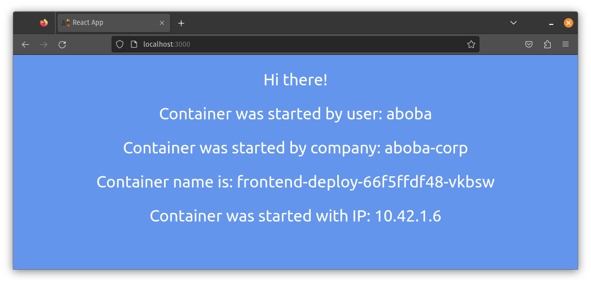
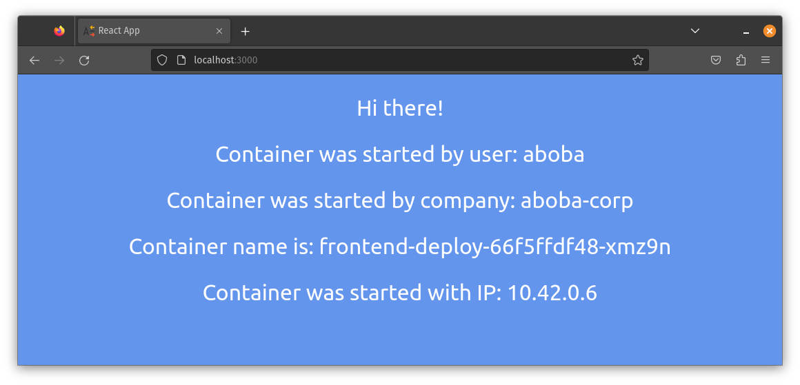

# Lab #2

University: [ITMO University](https://itmo.ru/ru/)
Faculty: [FICT](https://fict.itmo.ru)
Course: [Introduction to distributed technologies](https://github.com/itmo-ict-faculty/introduction-to-distributed-technologies)
Year: 2023/2024
Group: K4113c
Author: Kutsenko Alexey Victorovich
Lab: Lab2
Date of create: 21.10.2023
Date of finished: --.--.----


| Пункт                  | Описание                   |
| :--------------------- | :------------------------- |
| Описание лабораторной  | [problem](docs/README.md) |


```bash
vnuk@pop-os:~$ kubectl port-forward frontend-deploy-66f5ffdf48-xmz9n 3000:3000

Forwarding from 127.0.0.1:3000 -> 3000
Forwarding from [::1]:3000 -> 3000
Handling connection for 3000
Handling connection for 3000
```

```bash
vnuk@pop-os:~$ kubectl logfrontend-deploy-66f5ffdf48-vkbswsw

Builing frontend
Browserslist: caniuse-lite is outdated. Please run:
  npx update-browserslist-db@latest
  Why you should do it regularly: https://github.com/browserslist/update-db#readme
Browserslist: caniuse-lite is outdated. Please run:
  npx update-browserslist-db@latest
  Why you should do it regularly: https://github.com/browserslist/update-db#readme
build finished
Server started on port 3000
```



```bash
vnuk@pop-os:~$ kubectl logs frontend-deploy-66f5ffdf48-xmz9n

Builing frontend
Browserslist: caniuse-lite is outdated. Please run:
  npx update-browserslist-db@latest
  Why you should do it regularly: https://github.com/browserslist/update-db#readme
Browserslist: caniuse-lite is outdated. Please run:
  npx update-browserslist-db@latest
  Why you should do it regularly: https://github.com/browserslist/update-db#readme
build finished
Server started on port 3000
vnuk@pop-os:~$ 
```

