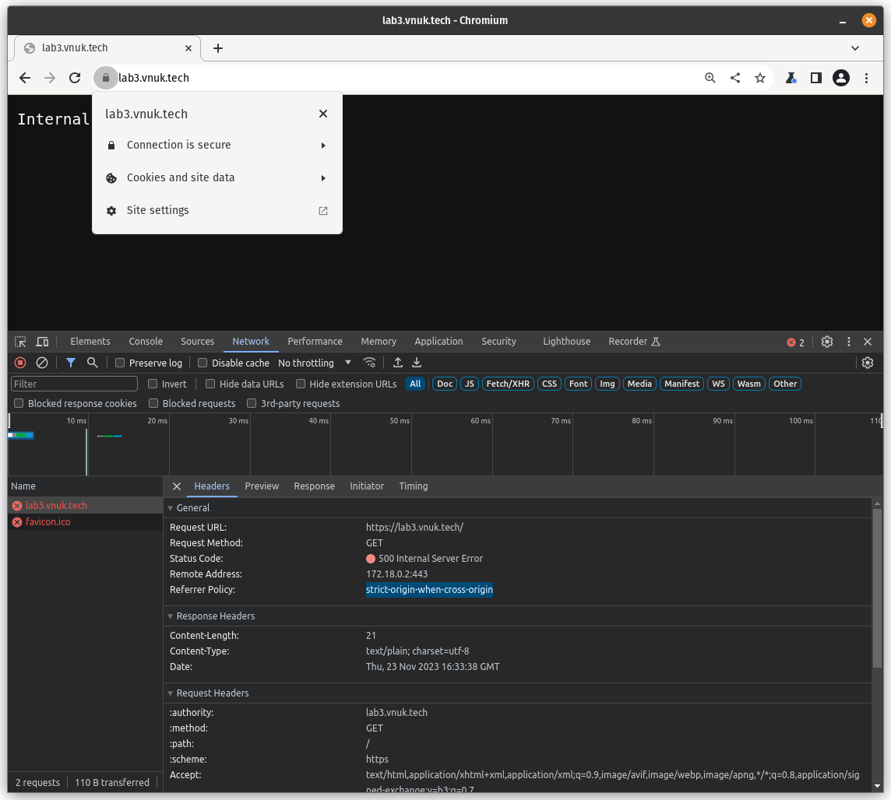
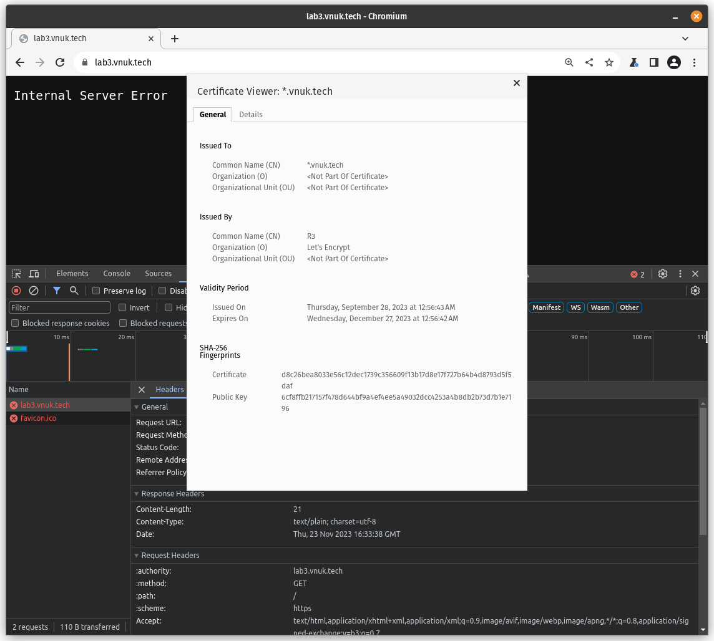
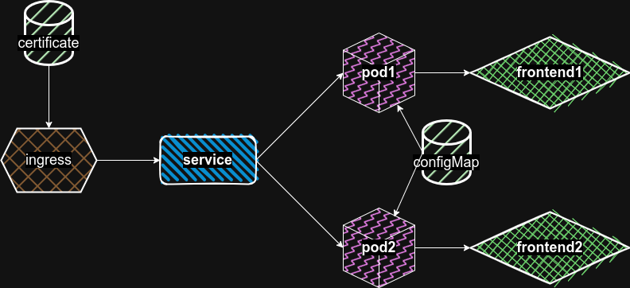

## Лабораторная работа №3 "Сертификаты и "секреты" в k8s, безопасное хранение данных."

University: [ITMO University](https://itmo.ru/ru/)
Faculty: [FICT](https://fict.itmo.ru)
Course: [Introduction to distributed technologies](https://github.com/itmo-ict-faculty/introduction-to-distributed-technologies)
Year: 2023/2024
Group: K4113c
Author: Kutsenko Alexey Victorovich
Lab: Lab3
Date of create: 21.10.2023
Date of finished: --.--.----

Сертификат получил через lets encrypt на домен

```bash
certbot -d *.vnuk.tech -d vnuk.tech --manual --preferred-challenges dns certonly
```

После этого для подтверждения владения доменом неоходимо будет задеплоить TXT DNS запись со сгенерированным certbot текстом.
После успешной проверки certbot сгенерирует приватную и публичную части сертификата.

```bash
vnuk@pop-os:~/Documents/itmo/dt/lab3/certs$ k create secret tls lab3-tls --key /home/vnuk/Documents/itmo/dt/lab3/certs/privkey.pem --cert /home/vnuk/Documents/itmo/dt/lab3/certs/fullchain.pem

secret/lab3-tls created
```

```bash
vnuk@pop-os:~/Documents/itmo/dt/lab3/k8s$ k apply -f configmap.yml -f deployment.yml -f service.yml -f ingress.yml

configmap/frontend-service created
configmap/config created
deployment.apps/deploy-frontend created
service/service-frontend created
ingress.networking.k8s.io/ingress-frontend created
```

```bash
vnuk@pop-os:~/Documents/itmo/dt/lab3/k8s$ k describe ingress

Name:             ingress-frontend
Labels:           <none>
Namespace:        default
Address:          172.18.0.2 <-------------
Ingress Class:    traefik
Default backend:  <default>
TLS:
  lab3-tls terminates lab3.vnuk.tech
Rules:
  Host            Path  Backends
  ----            ----  --------
  lab3.vnuk.tech
                  /   service-frontend:443 (10.42.0.10:3000,10.42.0.9:3000)
Annotations:      <none>
Events:           <none>
```

В DNS надо добавить запись нашего FQDN на ip ингресса (подойдет `/etc/hosts`):

```
127.0.0.1       localhost
127.0.1.1       pop-os.localdomain      pop-os
172.18.0.2      lab3.vnuk.tech
```





В итоге все поднялось успешно, сертификат валидный, но не загружается из-за проблемы с CORS

## Схема


