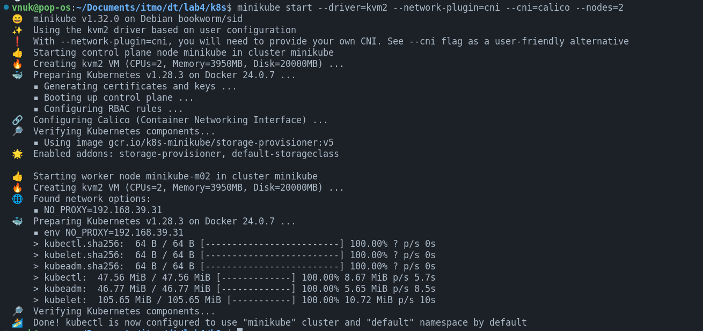
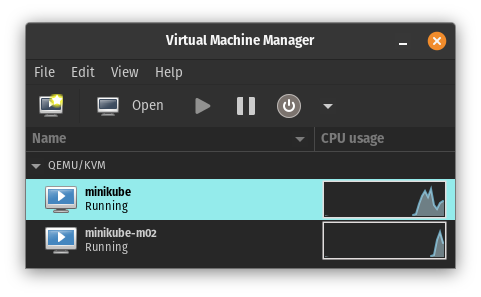
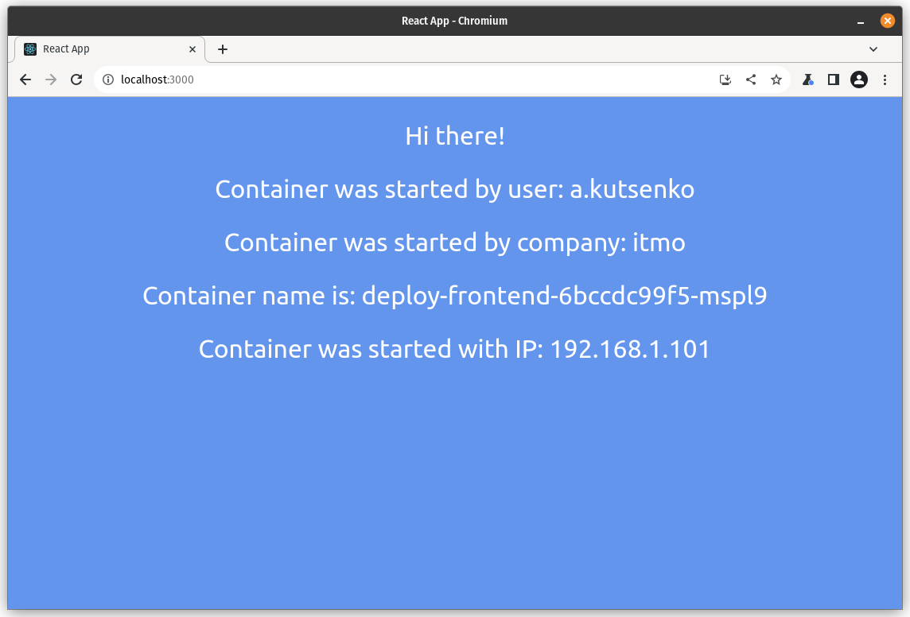

## Лабораторная работа №4 "Сети связи в Minikube, CNI и CoreDNS"

University: [ITMO University](https://itmo.ru/ru/)
Faculty: [FICT](https://fict.itmo.ru)
Course: [Introduction to distributed technologies](https://github.com/itmo-ict-faculty/introduction-to-distributed-technologies)
Year: 2023/2024
Group: K4113c
Author: Kutsenko Alexey Victorovich
Lab: Lab4
Date of create: 21.10.2023
Date of finished: --.--.----

https://habr.com/ru/companies/flant/articles/485716

На данный момент с сетевыми плагинами в k3d наблюдаются проблемы, поэтому будет использован minikube с kvm драйвером для виртуальных машин.

```bash
minikube start --driver=kvm2 --network-plugin=cni --cni=calico --nodes=2
```





```bash
vnuk@pop-os:~/Documents/itmo/dt/lab4/k8s$ k get pods -l k8s-app=calico-node -A

NAMESPACE     NAME                READY   STATUS    RESTARTS   AGE
kube-system   calico-node-l78mk   1/1     Running   0          2m1s
kube-system   calico-node-t8dzv   1/1     Running   0          88s
```

```bash
vnuk@pop-os:~/Documents/itmo/dt/lab4/k8s$ k label nodes minikube rack=0
node/minikube labeled

vnuk@pop-os:~/Documents/itmo/dt/lab4/k8s$ k label nodes minikube-m02 rack=1
node/minikube-m02 labeled
```

```bash
vnuk@pop-os:~/Documents/itmo/dt/lab4/k8s$ k create -f calicoctl.yml
serviceaccount/calicoctl created
pod/calicoctl created
clusterrole.rbac.authorization.k8s.io/calicoctl created
clusterrolebinding.rbac.authorization.k8s.io/calicoctl created
```

```bash
vnuk@pop-os:~/Documents/itmo/dt/lab4/k8s$ kubectl exec -i -n kube-system calicoctl -- /calicoctl --allow-version-mismatch get ippools -o wide
NAME                  CIDR            NAT    IPIPMODE   VXLANMODE   DISABLED   DISABLEBGPEXPORT   SELECTOR
default-ipv4-ippool   10.244.0.0/16   true   Always     Never       false      false              all()
```

```bash
vnuk@pop-os:~/Documents/itmo/dt/lab4/k8s$ k delete ippools default-ipv4-ippool
ippool.crd.projectcalico.org "default-ipv4-ippool" deleted
```

```bash
vnuk@pop-os:~/Documents/itmo/dt/lab4/k8s$ kubectl exec -i -n kube-system calicoctl -- /calicoctl --allow-version-mismatch create -f - < calico-ippool.yml
Successfully created 2 'IPPool' resource(s)
```

```bash
vnuk@pop-os:~/Documents/itmo/dt/lab4/k8s$ kubectl exec -i -n kube-system calicoctl -- /calicoctl --allow-version-mismatch get ippools -o wide
NAME            CIDR               NAT    IPIPMODE   VXLANMODE   DISABLED   DISABLEBGPEXPORT   SELECTOR
rack-0-ippool   192.168.100.0/24   true   Always     Never       false      false              rack == "0"
rack-1-ippool   192.168.1.0/24     true   Always     Never       false      false              rack == "1"
```

```bash
vnuk@pop-os:~/Documents/itmo/dt/lab4/k8s$ k get pods -o wide
NAME                               READY   STATUS    RESTARTS   AGE   IP               NODE           NOMINATED NODE   READINESS GATES
deploy-frontend-6bccdc99f5-gllzj   1/1     Running   0          27s   192.168.100.65   minikube       <none>           <none>
deploy-frontend-6bccdc99f5-mspl9   1/1     Running   0          27s   192.168.1.101      minikube-m02   <none>           <none>
```

```bash
vnuk@pop-os:~/Documents/itmo/dt/lab4/k8s$ k port-forward services/service-frontend 3000:3000
Forwarding from 127.0.0.1:3000 -> 3000
Forwarding from [::1]:3000 -> 3000
```



```bash
vnuk@pop-os:~/Documents/itmo/dt/lab4/k8s$ k exec -it deploy-frontend-6bccdc99f5-gllzj -- sh

/frontend # ping 192.168.100.65
PING 192.168.100.65 (192.168.100.65): 56 data bytes
64 bytes from 192.168.100.65: seq=0 ttl=64 time=0.085 ms
64 bytes from 192.168.100.65: seq=1 ttl=64 time=0.024 ms
64 bytes from 192.168.100.65: seq=2 ttl=64 time=0.045 ms
64 bytes from 192.168.100.65: seq=3 ttl=64 time=0.049 ms
^C
--- 192.168.100.65 ping statistics ---
4 packets transmitted, 4 packets received, 0% packet loss
round-trip min/avg/max = 0.024/0.050/0.085 ms
```
